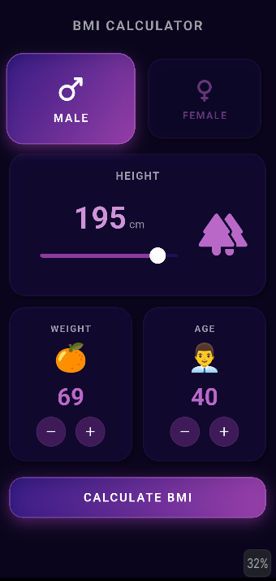

# Premium Neon BMI Calculator 🚀

A sleek, beautiful, and highly interactive **BMI (Body Mass Index) Calculator** built using **Flutter**. Designed with a modern dark-neon aesthetic and focus on exceptional user experience (UX).

## ✨ Features
* **Modern Dark/Neon UI:** Eye-catching design utilizing custom gradients and glowing container aesthetics.
* **Interactive Sliders & Selectors:** Smooth height adjustments and user-friendly weight/age counters.
* **Smart Calculation Logic:** Instant and accurate BMI calculation according to standard health metrics.
* **Adaptive Result Screen:** Displays dynamic health advice and classifications based on the user's BMI score.

## 🛠️ Tech Stack & Concepts
* **Framework:** Flutter (Dart)
* **State Management:** Clean state handling for interactive UI elements.
* **Responsive Design:** Optimized layout that scales beautifully across various screen sizes.

## 📱 Screenshots

  

